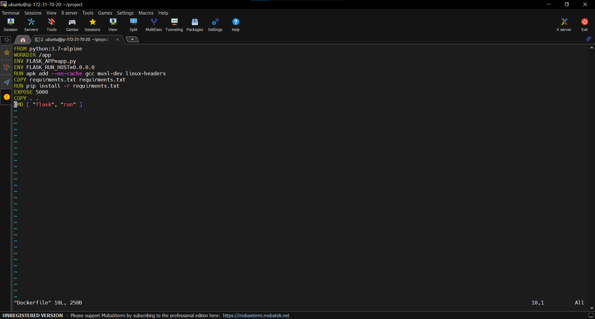
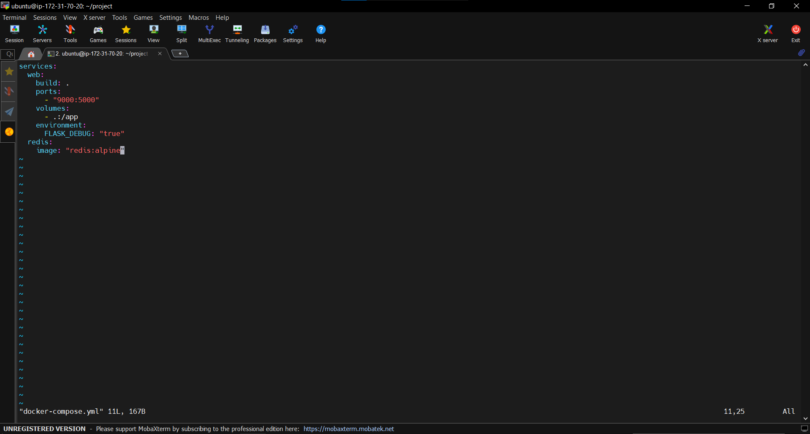
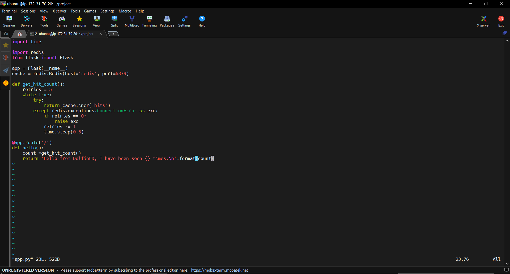
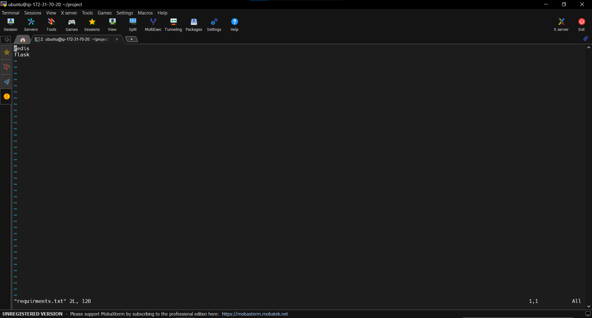
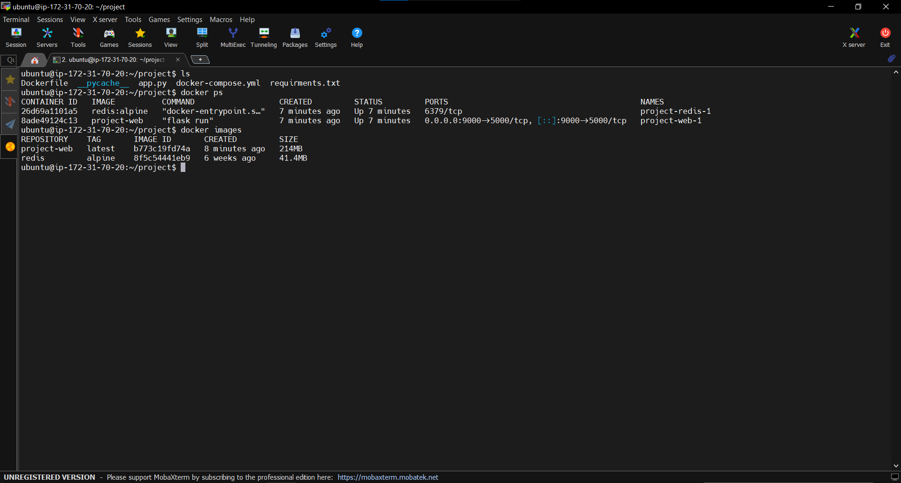
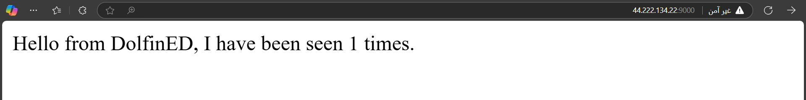
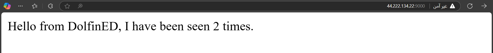
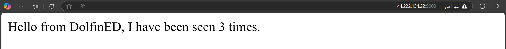
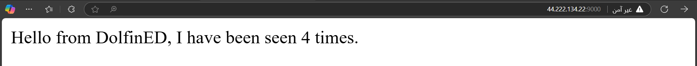
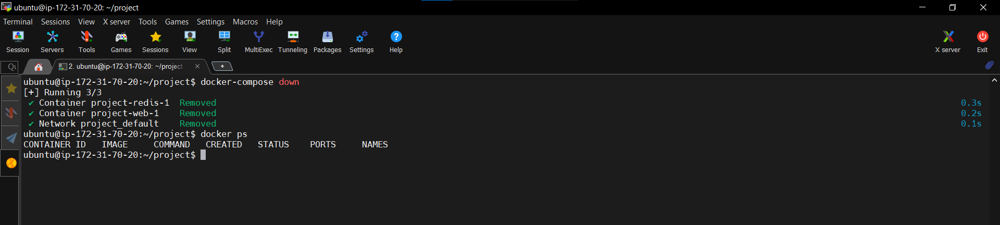

# Dockerized Flask & Redis App

This project demonstrates a simple web application using Flask and Redis, fully containerized with Docker and deployed on an AWS EC2 instance.

## 📌 Project Overview
This project is a simple web application using **Flask** and **Redis**, originally developed by another source. My role was to containerize the application using **Docker**, orchestrate it with **Docker Compose**, and deploy it on an **AWS EC2** instance.

## 🏗️ Project Structure
```
project/
│-- Dockerfile
│-- docker-compose.yaml
│-- app.py
│-- requirements.txt
```

### 🔹 `Dockerfile`
Defines the container environment for the Flask application.



### 🔹 `docker-compose.yaml`
Configures the multi-container setup, linking Flask and Redis.



### 🔹 `app.py`
A simple Python script handling requests and interacting with Redis.



### 🔹 `requirements.txt`
Specifies the required dependencies (Flask & Redis).



---

## 🚀 Running the Project
### 1️⃣ Clone the Repository
```bash
git clone https://github.com/yourusername/repository-name.git
cd repository-name
```

### 2️⃣ Build and Start the Containers
```bash
docker-compose up -d
```

#### ✅ Running Containers, Directory Structure & Images
This screenshot shows the running containers along with the project directory and images:


### 3️⃣ Application Verification
The application was tested by refreshing the page multiple times to ensure proper session handling. Below are the screenshots showing the working interface:

#### ✅ App Running Successfully





### 4️⃣ Stopping the Application
To stop and remove the running containers, run:
```bash
docker-compose down
```
After this, the application is no longer accessible.

#### ⛔ Containers & Images After Stopping
This screenshot shows the project directory, images, and stopped containers after running `docker-compose down`:


---

## 🛠️ Built With
- **Python** 🐍 (Flask & Redis)
- **Docker & Docker Compose** 🐳
- **AWS EC2** ☁️

## 📢 Contributing
Feel free to fork this repository, submit issues, or create pull requests!

## 📜 License
This project is licensed under the MIT License.

---

📌 **Author:** Mo Saeed Tello
📌 **Deployment & Containerization:** Mo Saeed Tello    
📌 **GitHub:** [SaaedT](https://github.com/SaaedT)

